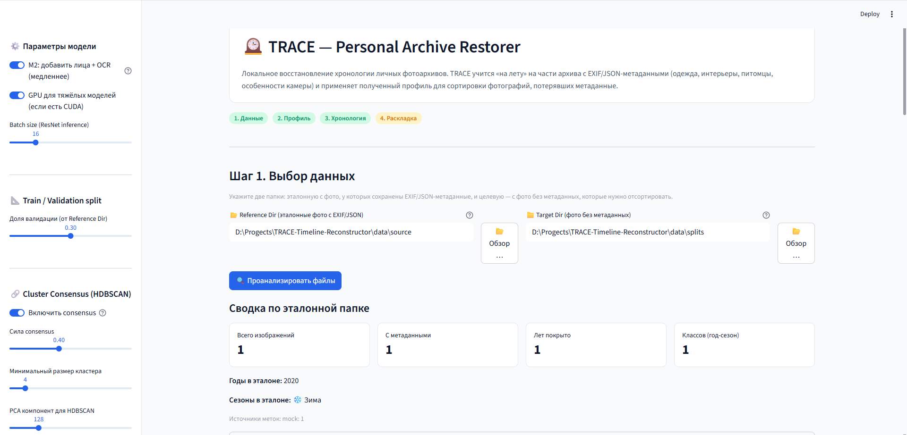
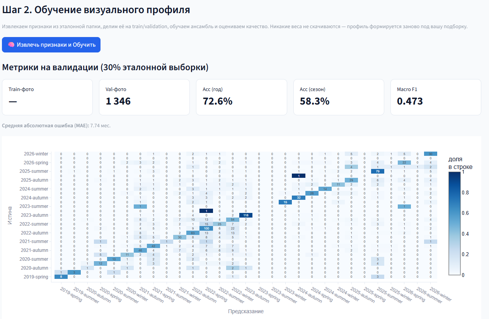
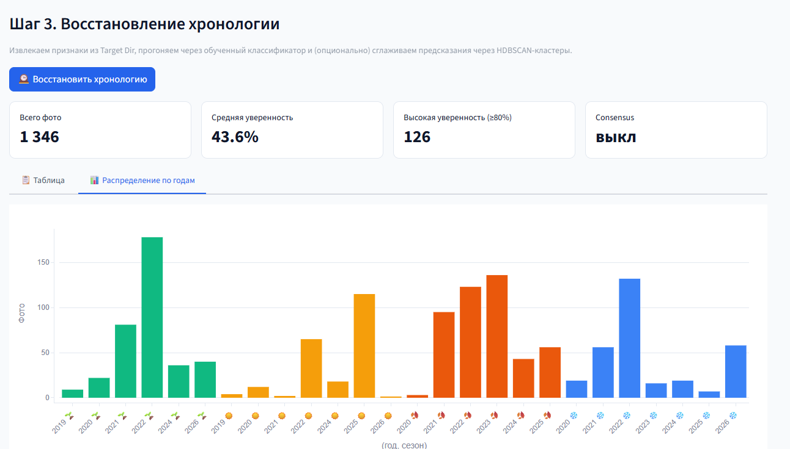
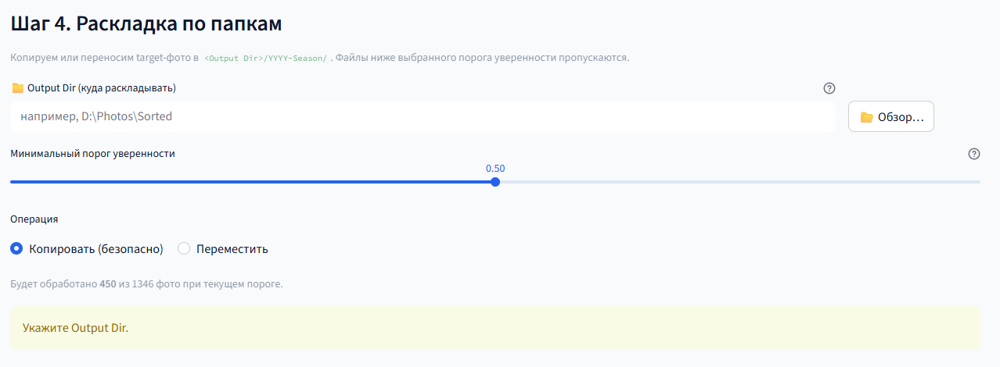

# TRACE — Personal Archive Restorer

> Временная локализация фотографий (год + сезон) по визуальному содержанию,
> с персональной подгонкой модели под каждый отдельный архив.

TRACE решает задачу **слабо-размеченной классификации с доменной адаптацией**:
по части архива, где даты ещё можно восстановить из метаданных, обучается
персональный визуальный классификатор `(год, сезон)`, который затем размечает
фотографии, потерявшие EXIF. Никаких облачных API и предобученных временных
весов — единственная внешняя модель — это `ImageNet`-backbone, используемый как
замороженный экстрактор признаков.



## Постановка ML-задачи

| Аспект | Решение |
| --- | --- |
| **Тип задачи** | Многоклассовая классификация, класс = `f"{year}-{season}"` |
| **Целевая переменная** | Год (2005–2030) × сезон (winter/spring/summer/autumn) |
| **Разметка** | Слабая (weak supervision): метки добываются эвристиками из EXIF / Google Takeout JSON / имени файла / имени папки |
| **Парадигма** | Few-shot персонализация: модель переобучается на каждый архив отдельно (per-archive domain shift) |
| **Transfer learning** | Frozen `ResNet-50 (ImageNet)` как feature extractor, без fine-tuning |
| **Признаки** | Мультимодальные: deep embedding + hand-crafted color/lighting (+ опц. face-эмбеддинги, OCR) |
| **Модель** | Гетерогенный soft-voting ансамбль (kNN + RandomForest + LogisticRegression) |
| **Доп. сигнал** | Полу-надзорное сглаживание через HDBSCAN + label propagation по кластерам |
| **Метрики** | Accuracy@year, Accuracy@(year,season), macro/weighted-F1, MAE (в месяцах) |

Почему именно персонализация, а не одна глобальная модель: распределение
визуальных признаков (одежда, интерьеры, питомцы, оптика конкретной камеры)
уникально для каждого человека. Глобальная модель страдает от domain shift;
TRACE вместо этого fit'ит лёгкий классификатор поверх замороженных эмбеддингов
прямо на пользовательской выборке и **честно валидирует его на отложенной 30%
части эталона** до применения к немаркированным фото.

## ML-пайплайн

```
weak labels        feature extraction          model                inference
(EXIF/JSON/имя) ─▶ ResNet-50 ┐                                       ┌▶ (year, season)
                  color/HSV  ├▶ concat ▶ StandardScaler ▶ ensemble ─┤   + confidence
                  lighting   │            (kNN+RF+LR, soft-voting)   └▶ CSV / раскладка
                  faces*/ocr*┘                    │
                                        HDBSCAN cluster consensus
                                        (label propagation, опц.)
```

1. **Слабая разметка** (`src/prepare/ground_truth.py`). Дата фото восстанавливается
   с приоритетом источников: Google Takeout JSON-сайдкар → дата в имени файла
   (`IMG_YYYYMMDD`, Unix-timestamp, Telegram/Android-форматы) → год в имени папки.
   Конфликты между источниками (расхождение > 30 дней) фиксируются. Из даты
   выводится метка `(year, season)`, где сезон — астрономо-бытовой
   (зима = дек+янв+фев).

2. **Извлечение признаков** (`src/features/`). Каждое изображение кодируется в
   мультимодальный вектор (см. ниже). Эмбеддинги кэшируются в `.npz` по `id`,
   чтобы повторный train/predict не платил за инференс заново.

3. **Обучение** (`src/models/classifier.py`). На train-части (стратифицированный
   70/30 split по классу `(year, season)`) обучается soft-voting ансамбль.

4. **Инференс + сглаживание** (`src/models/clustering.py`). Признаки целевых фото
   прогоняются через ансамбль; опционально HDBSCAN группирует визуально близкие
   кадры («события»), и предсказания смешиваются с голосами размеченных соседей
   по кластеру.

## Признаки (feature engineering)

Полный вектор — конкатенация в стабильном порядке `[resnet | color | lighting | faces | ocr]`:

| Блок | Размерность | Извлечение | Сигнал |
| --- | --- | --- | --- |
| **ResNet-50 embedding** | 2048 | `torchvision` ResNet-50 (ImageNet), `fc` → `Identity`, выход GlobalAvgPool | Семантика сцены, стиль, обстановка |
| **HSV-гистограмма** | 512 | OpenCV `calcHist`, бины 8×8×8, L1-норма | Общий цветовой профиль кадра |
| **Сезонные индикаторы** | 2 | Бинарные детекторы снега (высокий V, низкий S) и листвы (зелёный hue + насыщенность) | Сильный сезонный признак |
| **Lighting** | 5 | mean/std яркости + средний RGB верхней трети («небо») | Время суток, погода, сезон |
| **Face embeddings** *(M2)* | 513 | `insightface` RetinaFace+ArcFace, среднее по лицам + флаг `has_face` | Возраст/состав людей во времени |
| **OCR years** *(M2)* | 27 | `EasyOCR` (ru+en) → one-hot годов 2005–2030 + флаг `has_text` | Прямая дата на скриншотах/документах |

- **M1 (core)** — вектор размерности **2567**: ResNet + color + lighting.
- **M2 (full)** — вектор размерности **3107**: core + faces + OCR (точнее, медленнее).

Hand-crafted признаки и deep embedding дополняют друг друга: ResNet ловит
семантику, цвет/свет — явные сезонные маркеры, которые легко интерпретировать и
которые устойчивы на малых выборках.

## Модель: гетерогенный soft-voting ансамбль

Три классификатора с разной индуктивной предвзятостью голосуют взвешенным
средним предсказанных вероятностей:

| Базовый классификатор | Вход | Конфигурация | Вес | Роль |
| --- | --- | --- | --- | --- |
| **kNN** | только ResNet-эмбеддинг | `k=7`, cosine-метрика, `weights="distance"` | 0.3 | Семантические соседи в embedding-пространстве |
| **RandomForest** | полный масштабированный вектор | 300 деревьев, `class_weight="balanced"` | 0.5 | Нелинейные взаимодействия, устойчивость к дисбалансу |
| **LogisticRegression** | полный масштабированный вектор | `class_weight="balanced"`, `C=1.0` | 0.2 | Калиброванные вероятности для голосования |

```
proba = 0.3 · knn.predict_proba(resnet)
      + 0.5 · rf.predict_proba(scaled_full)
      + 0.2 · lr.predict_proba(scaled_full)
```

kNN намеренно работает только на ResNet-части (cosine-близость осмысленна именно
в семантическом embedding-пространстве), тогда как RF и LR видят весь вектор
после `StandardScaler`. Все три используют `class_weight="balanced"` / взвешивание
по расстоянию, потому что персональные архивы сильно несбалансированы по годам.



### Полу-надзорное сглаживание (cluster consensus)

Фотографии одной съёмочной серии («события») имеют близкие ResNet-эмбеддинги.
`HDBSCAN` (после `PCA → 128` для подавления шума и ускорения на матрице
≈4500×2048) выделяет такие группы; внутри кластера предсказание целевого фото
смешивается с голосами размеченных соседей — классический label propagation:

```
smoothed = (1 − w) · base_proba + w · normalized_cluster_vote      # w = 0.5
```

Шумовые точки (`label = -1`) и кластеры без размеченных соседей остаются без
изменений. Режим включается опционально.

## Протокол обучения и валидации

- **Split**: стратифицированный по классу `(year, season)`, `test_size = 0.30`,
  `min_class_size = 2`, фиксированный `seed = 42`. Все случайные процессы
  (RF, LR, PCA, split) детерминированы.
- **Честная оценка**: метрики считаются на отложенной 30% части эталона
  (`src/pipeline/evaluate.py`) — пользователь видит, как профиль сработает,
  *до* применения к немаркированным фото.
- **Метрики**:
  - `Accuracy@year` — доля точно угаданных годов;
  - `Accuracy@(year, season)` — точное совпадение полного класса;
  - `macro-F1` / `weighted-F1` — устойчивость к дисбалансу классов;
  - `MAE` в месяцах — среднее отклонение предсказанной центральной даты сезона
    от истинной (мягкая метрика: ошибка «зима↔весна» дешевле, чем «2015↔2022»);
  - confusion matrix по классам `(year, season)`.



## Стек

- **CV/ML**: PyTorch + `torchvision` (ResNet-50), `scikit-learn` (kNN / RF / LR /
  `StandardScaler` / `PCA`), `hdbscan`, OpenCV, NumPy, Pillow / pillow-heif
- **M2 (опционально)**: `insightface` (RetinaFace + ArcFace, ONNX), `EasyOCR` (ru+en)
- **UI / визуализация**: Streamlit + Plotly, Matplotlib (confusion matrix)
- **Тесты**: pytest + pytest-cov (≥ 80% покрытия ядра, детерминированные фикстуры)

Никаких облачных инференс-API: единственная сетевая активность — разовая загрузка
весов `ResNet-50` из официального индекса torchvision (и моделей insightface /
EasyOCR в M2) при первом запуске. Изображения никуда не отправляются.

## Структура проекта

```
src/
├── config.py                # Гиперпараметры (kNN/RF/LR/HDBSCAN), split, seed, размерности
├── prepare/                 # Слабая разметка: GT из EXIF/JSON/имени, EXIF-стриппинг, split
│   ├── ground_truth.py      #   восстановление (year, season) из метаданных
│   └── split.py             #   стратифицированный train/test
├── features/                # Экстракторы признаков
│   ├── resnet.py            #   2048-d ImageNet-эмбеддинг (frozen backbone)
│   ├── color.py             #   HSV-гистограмма + детекторы снега/листвы
│   ├── lighting.py          #   яркость + цвет «неба»
│   ├── faces.py             #   M2: insightface RetinaFace+ArcFace
│   └── ocr.py               #   M2: EasyOCR → one-hot годов
├── models/
│   ├── classifier.py        # Soft-voting ансамбль kNN+RF+LR
│   └── clustering.py        # HDBSCAN + cluster consensus (label propagation)
├── pipeline/
│   ├── common.py            #   FeatureBundle: выравнивание/конкатенация кэшей
│   ├── feature_pipeline.py  #   извлечение признаков для произвольных списков
│   ├── train.py / predict.py / evaluate.py
│   └── wizard.py            #   высокоуровневый API для UI (4 шага)
└── app/                     # Streamlit-приложение (демонстрационный UI)
tests/                       # pytest, ≥ 80% покрытия ядра
models/wizard/<hash>/        # Кэш признаков + обученный classifier на сессию
```

## Быстрый старт

### Требования

- Python 3.11 / 3.12
- 4–8 GB RAM на архив 4–5 тыс. фото
- Опционально: NVIDIA GPU (CUDA) для ускорения ResNet и face-эмбеддингов

### Установка

С [`uv`](https://docs.astral.sh/uv/) (рекомендуется — резолвит платформозависимый torch автоматически):

```bash
git clone https://github.com/<user>/TRACE-Timeline-Reconstructor.git
cd TRACE-Timeline-Reconstructor
uv sync                       # ядро (M1)
uv sync --extra m2            # опционально: faces + OCR
```

> На Windows ставится torch с CUDA 12.4, на Linux — CPU-сборка. Это прописано в
> `pyproject.toml` через платформенные маркеры, настраивать ничего не нужно.

### Запуск демо-приложения

```bash
make app
# или напрямую:
uv run streamlit run src/app/streamlit_app.py
```

Откроется `http://localhost:8501` с мастером из четырёх шагов: выбор данных →
обучение профиля с метриками валидации → инференс на целевых фото → раскладка по
папкам `YYYY-Season/`. В сайдбаре переключаются M1↔M2, cluster consensus, доля
валидации и параметры HDBSCAN.



### Команды разработки

| Команда            | Что делает                                   |
| ------------------ | -------------------------------------------- |
| `make install`     | Установить ядро через `uv sync`              |
| `make install-m2`  | Установить ядро + faces + OCR                |
| `make test`        | Все тесты с покрытием                        |
| `make test-fast`   | Тесты без `slow` / `integration` маркеров    |
| `make app`         | Запустить Streamlit-приложение               |
| `make clean`       | Удалить кэши, артефакты обучения, отчёты     |

```bash
uv run pytest tests/ -v                   # все тесты (cov-fail-under=80)
uv run pytest tests/ -v -m "not slow"     # быстрые тесты
```

## Конфиденциальность

Все вычисления — локально. Никакой telemetry, никакой отправки изображений,
никаких внешних inference-API. Сетевая активность ограничена разовой загрузкой
весов моделей (ResNet-50; в M2 — insightface и EasyOCR) и обновлением зависимостей.

## Лицензия и вклад

См. [LICENSE](LICENSE) и [CONTRIBUTING.md](CONTRIBUTING.md).
